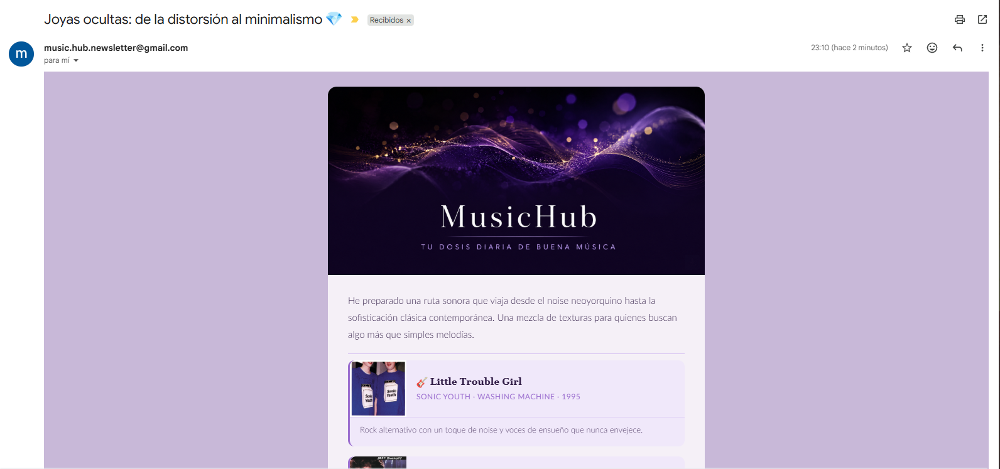

# 🎵 MusicHub — AI Music Recommender Agent

An autonomous AI agent that curates daily music recommendations across multiple genres and delivers them via email. Built with Python, Gemini, Spotify, and Last.fm.



## What it does

Every day, MusicHub:

1. **Builds a curated candidate pool** combining three sources per genre: direct tracks from reference artists, similar artists discovered via Last.fm, and genre-based Spotify searches
2. **An LLM curates the best picks** — Gemini 3 Flash analyzes the pool, selects the most interesting tracks guided by a per-genre editorial style reference, and writes a personalized reason for each one
3. **Checks the history** in a local SQLite database to ensure no song is ever repeated
4. **Sends a styled email** to a list of recipients with album art, Spotify links, and the curator's notes

📌 The agent currently generates recommendations and emails in Spanish. Language can be adjusted in the system prompt (`agent/prompts.py`).

## Tech Stack

| Component | Technology |
|-----------|-----------|
| Language | Python 3.12+ |
| LLM | Google Gemini 3 Flash (free tier) |
| Music discovery | Spotify Web API via `spotipy` + Last.fm API |
| Database | SQLite |
| Email | Gmail SMTP |
| Scheduling | GitHub Actions (cron) |

## Project Structure

```
music-recommender-agent/
├── agent/
│   ├── config.py            # Centralized configuration
│   ├── prompts.py           # LLM system prompt and editorial style references
│   ├── llm.py               # Gemini API wrapper with retry logic
│   ├── music_search.py      # Spotify + Last.fm search and candidate generation
│   ├── memory.py            # SQLite history (read/write/dedup)
│   ├── email_builder.py     # HTML email construction with real data
│   ├── email_sender.py      # SMTP delivery
│   └── main.py              # Orchestrator — runs the full pipeline
├── templates/
│   └── email_template.html  # Email HTML template
├── data/
│   └── history.db           # Auto-generated recommendation history
├── .env                     # API keys (not committed)
├── .gitignore
├── requirements.txt
└── README.md
```

## How the flow works

```
Last.fm API              Spotify API                Gemini 3 Flash             SQLite
    │                        │                            │                       │
    ├─ Similar artists ──►   ├─ Reference artists         │                       │
    │                        ├─ Similar artists      Pool of ~80-90               │
    │                        └─ Genre search ──────► real tracks                  │
    │                                                     │                       │
    │                                             Select best 5                   │
    │                                             + write reasons                 │
    │                                                     │                       │
    │                                                     ├── Check against ◄─────┤
    │                                                     │   history (no repeats)│
    │                                                     │                       │
    │                                             Build email with real           │
    │                                             Spotify URLs + album art        │
    │                                                     │                       │
    │                                             Send via Gmail SMTP             │
    │                                                     │                       │
    │                                                     ├── Save to history ───►│
```

## Candidate pool strategy

For each genre, the pool is built from three sources:

| Source | Weight | Purpose |
|--------|--------|---------|
| Reference artists (direct) | 40% | Anchor — tracks from known quality artists |
| Similar artists via Last.fm | 40% | Discovery — artists in the same orbit |
| Genre search (Spotify) | 20% | Diversity — broader fallback |

Each genre has a curated list of reference artists that defines its editorial style. The LLM is instructed to use these as a compass, prioritizing discovery over the references themselves.

## Setup

### 1. Clone and install

```bash
git clone https://github.com/marcmdf36/music-recommender-agent.git
cd music-recommender-agent
pip install -r requirements.txt
```

### 2. Get your API keys

- **Gemini** — Create a free key at [aistudio.google.com/apikey](https://aistudio.google.com/apikey)
- **Spotify** — Create an app at [developer.spotify.com/dashboard](https://developer.spotify.com/dashboard) and copy Client ID + Secret
- **Last.fm** — Create a free API account at [last.fm/api/account/create](https://www.last.fm/api/account/create)
- **Gmail** — Enable 2FA on your Google account, then generate an App Password under Security → App Passwords

### 3. Configure environment

Create a `.env` file in the project root:

```
GEMINI_API_KEY=your_gemini_key
SPOTIFY_CLIENT_ID=your_client_id
SPOTIFY_CLIENT_SECRET=your_client_secret
LASTFM_API_KEY=your_lastfm_key
SMTP_EMAIL=your_email@gmail.com
SMTP_PASSWORD=your_16char_app_password
RECIPIENTS=email1@gmail.com,email2@gmail.com
```

### 4. Run

```bash
python -m agent.main
```

## Configuration

Genres and other parameters are easily adjustable in `agent/config.py`:

```python
GENRES = ["rock", "indie", "electronic", "pop", "classical"]
SONGS_PER_DAY = 5
```

To add a new genre, add it to the `GENRES` list and ensure matching entries exist in both `SEARCH_QUERIES` and `REFERENCE_ARTISTS` in `music_search.py`.

## What I learned

- Designing an LLM agent pipeline: prompt engineering, structured JSON output, and grounding LLM decisions on real data to avoid hallucinations
- Working with multiple music APIs (Spotify + Last.fm) and combining them for richer discovery
- Building modular Python architecture where each component is independently testable and replaceable
- HTML email templating with inline CSS for cross-client compatibility (Gmail, Outlook)
- Managing GitHub Actions secrets, scheduled workflows, and avoiding CI loops

## Future improvements

- ⭐ Listener rating system to refine future recommendations
- 📊 Analytics dashboard with recommendation history
- 🔄 Migration to LangChain/LangGraph for more complex agent workflows

## License

MIT